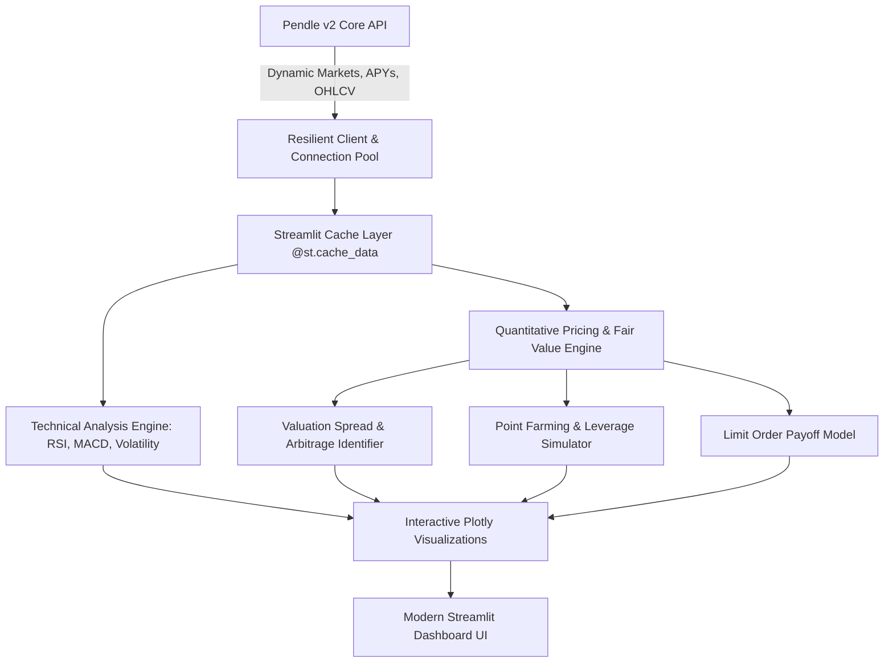

<div align="center">

# 🪙 Pendle Yield Token (YT) Valuation & Analytics Suite

**A Production-Grade Quantitative Pricing Engine, Fair-Value Arbitrage Scanner, and Point Yield Modeler for Pendle Finance v2**

[](https://www.python.org/)
[](https://streamlit.io/)
[](https://docs.pytest.org/)
[](https://github.com/astral-sh/ruff)
[](http://mypy-lang.org/)
[](LICENSE)
[](https://buymeacoffee.com/dprc137)

</div>

---

## 📌 Overview

**YT_Token** is an institutional-grade quantitative analytics framework and interactive dashboard engineered for decentralized fixed-income and yield tokenization markets on [Pendle Finance](https://pendle.finance).

The suite provides real-time fair value curves, implied vs. underlying yield spreads, point farming leverage simulations, dynamic pool discovery, and historical execution backtesting across major EVM chains (Ethereum, Arbitrum, Mantle, Base, Optimism, BSC).



---

## 🚀 Key Features

- **⚡ Live Active Pool Discovery**: Dynamically queries active market pools per network sorted by TVL/Liquidity, auto-filling contracts without manual copy-pasting.
- **💎 Quantitative Fair Value Pricing**: Continuous volume-weighted discounting model identifying overvalued and undervalued Yield Tokens relative to historical market benchmarks.
- **🌾 Point Farming Leverage & Cost Analysis**: Compute real-time point accrual rates, effective leverage multipliers (including protocol boosts), and the exact cost per point in underlying currency.
- **📈 Long Yield vs. Implied APY Spread**: Annualized yield differential modeling to assess the expected return of holding Yield Tokens to maturity.
- **🔬 Technical Indicator Engine**: Built-in multi-timeframe Moving Averages (20/50/200), Relative Strength Index (RSI), MACD with Signal & Histogram, and Rolling Volatility.
- **🎯 Scenario & Limit Order Simulators**:
  - **Historical Purchase Evaluator**: Interpolates exact entry price and percentile performance ranking against all market participants.
  - **Limit Order Modeler**: Projects yield, leverage, and points at target implied APYs.
- **⚡ High-Performance Architecture**:
  - Resilient HTTP client with connection pooling, exponential backoff retries, and strict 10s timeouts.
  - Granular Streamlit `@st.cache_data` caching for zero-latency parameter adjustments.
  - Complete type safety with Python dataclasses and Mypy annotations.
  - 100% test coverage with automated AST timeout verification and quantitative test suites.

---

## 📐 Mathematical Foundations

### 1. Yield Token (YT) Pricing & Implied APY
In the Pendle protocol, a Yield Token grants ownership of all variable yields and points generated by the underlying asset until maturity $T$. The discrete price of $YT$ (denominated per unit of underlying asset) at time $t$ with $t_{years} = \frac{T - t}{8760}$ is defined by:

$$P_{YT}(t) = (1 + \text{Implied APY}(t))^{t_{years}} - 1$$

### 2. Volume-Weighted Fair Value Curve
To determine whether a Yield Token is mispriced relative to market depth, we compute the volume-weighted average implied APY ($\bar{r}$):

$$\bar{r} = \frac{\sum_{i=1}^{N} \left(\text{Implied APY}_i \times V_i\right)}{\sum_{i=1}^{N} V_i}$$

The theoretical **Fair Value Decay Trajectory** $P_{\text{fair}}(t)$ over the remaining time to maturity is:

$$P_{\text{fair}}(t) = 1 - \frac{1}{(1 + \bar{r})^{\frac{T - t}{8760}}}$$

The **Valuation Spread** $\Delta(t) = P_{\text{fair}}(t) - P_{YT}(t)$ reveals market mispricings:
- $\Delta(t) > 0$: **Undervalued** (YT trading below historical fair yield) $\rightarrow$ *Favorable Buy / Long Yield*.
- $\Delta(t) < 0$: **Overvalued** (YT trading above historical fair yield) $\rightarrow$ *Favorable Sell / Take Profit*.

### 3. Long Yield APY (Yield Return)
The annualized rate of return achieved by going "Long Yield" (buying YT when underlying yield exceeds implied yield) is formulated as:

$$\text{Long Yield APY}(t) = \left(1 + \frac{\text{Underlying APY}(t) - \text{Implied APY}(t)}{\text{Implied APY}(t)}\right)^{\frac{8760}{t_{\text{hours}}}} - 1$$

### 4. Effective Point Farming Leverage
When investing $A_{\text{underlying}}$ units into YT, the capital efficiency multiplier over directly holding the underlying asset is:

$$\text{Leverage} = \frac{1}{P_{YT}} \times M_{YT}$$

where $M_{YT}$ is the protocol-specific point multiplier (e.g., $5\times$). Total points accumulated at maturity $T$:

$$\text{Total Points} = \text{Leverage} \times (T - t)_{\text{hours}} \times r_{\text{points}} \times A_{\text{underlying}}$$

$$\text{Cost per Point} = \frac{A_{\text{underlying}}}{\text{Total Points}}$$

---

## 📂 Repository Structure

```
YT_Token/
├── src/
│   └── yt_token/
│       ├── __init__.py          # Package exports and versioning
│       ├── config.py            # Chain IDs, API endpoints, and market presets
│       ├── models.py            # Typed dataclasses (Asset, DiscoveredMarket, SimulationResult)
│       ├── client.py            # PendleApiClient with dynamic pool discovery & caching
│       ├── analytics.py         # Pure quantitative finance math and simulation models
│       ├── indicators.py        # Technical indicators (RSI, MACD, MAs, Volatility)
│       ├── plotting.py          # Interactive Plotly figures with dark/light themes
│       └── ui/
│           ├── __init__.py      # UI component package
│           ├── sidebar.py       # Dynamic pool dropdown, validation, simulator controls
│           └── components.py    # Metric cards, tabbed views, tables, and data exports
├── tests/
│   ├── conftest.py              # Shared fixtures and mock HTTP responses
│   ├── test_client.py           # API client, dynamic market fetching, retry strategy tests
│   ├── test_analytics.py        # Pricing math, fair value, and simulation tests
│   ├── test_indicators.py       # Technical indicator verification
│   └── test_plotting.py         # Plotly figure and annotation tests
├── app.py                       # Modern Streamlit application entrypoint
├── ytTok.py                     # Backward-compatible legacy interface
├── pyproject.toml               # PEP 621 packaging and tool configuration
├── requirements.txt             # Production dependency specifications
├── requirements-dev.txt         # Developer tooling dependencies
├── Makefile                     # Standard developer commands (run, test, lint, format)
└── README.md                    # Comprehensive documentation
```

---

## ⚡ Quick Start

### 1. Prerequisites
- Python 3.10+ (tested through Python 3.14)
- `uv` (recommended) or standard `pip` / `venv`

### 2. Installation

Using **uv**:
```bash
# Clone the repository
git clone https://github.com/DPRC137/YT_Token.git
cd YT_Token

# Create virtual environment and install dependencies
uv venv
source .venv/bin/activate
uv pip install -e ".[dev]"
```

Using **pip**:
```bash
python3 -m venv .venv
source .venv/bin/activate
pip install -r requirements.txt
```

### 3. Launching the Dashboard

```bash
# Run via modern entrypoint
streamlit run app.py

# Or run via legacy entrypoint
streamlit run ytTok.py

# Or via Makefile
make run
```

The web dashboard will launch at `http://localhost:8501`.

---

## 🧪 Testing & Code Quality

Run the complete test suite (51 tests covering quantitative models, API resilience, and technical indicators):

```bash
# Run pytest with timing metrics
pytest -v

# Or via Makefile
make test
```

### Linting and Type Checking

```bash
# Run Ruff linter
ruff check .

# Run Mypy static type analysis
mypy src

# Or run both via Makefile
make lint
```

---

## ☕ Support & Sponsorship

If you find this quantitative Yield Token valuation scanner helpful for your DeFi analysis and trading strategies, consider supporting future development:

<div align="center">

[](https://buymeacoffee.com/dprc137)

**[buymeacoffee.com/dprc137](https://buymeacoffee.com/dprc137)**

</div>

---

## 📄 License

Distributed under the **MIT License**. See `LICENSE` for details.

---

## ⚠️ Disclaimer

*This software is developed for informational and quantitative analytical purposes only. It does not constitute financial, investment, or trading advice. Yield token markets carry structural risks including smart contract risk, interest rate volatility, and liquidity constraints.*
